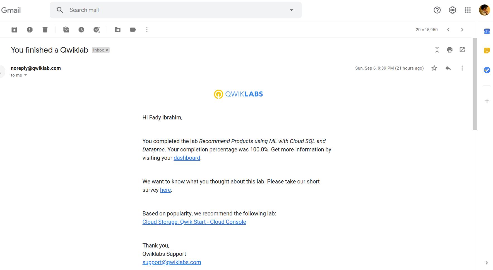
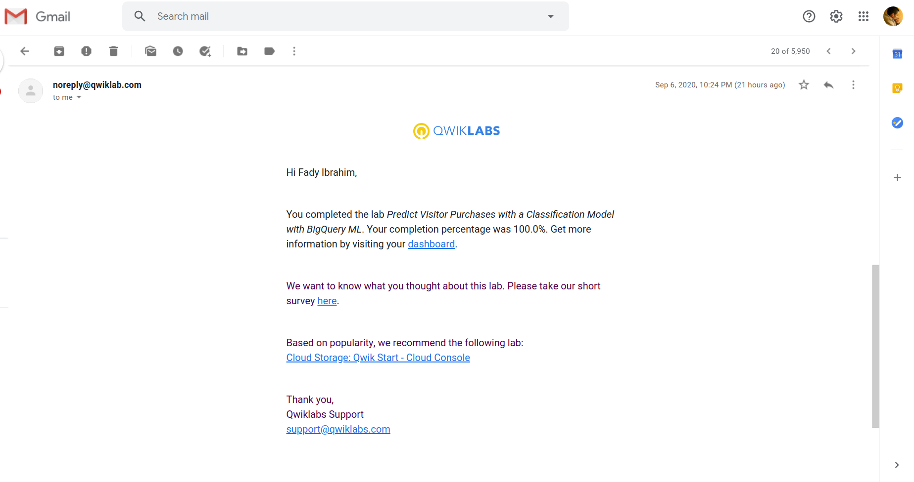
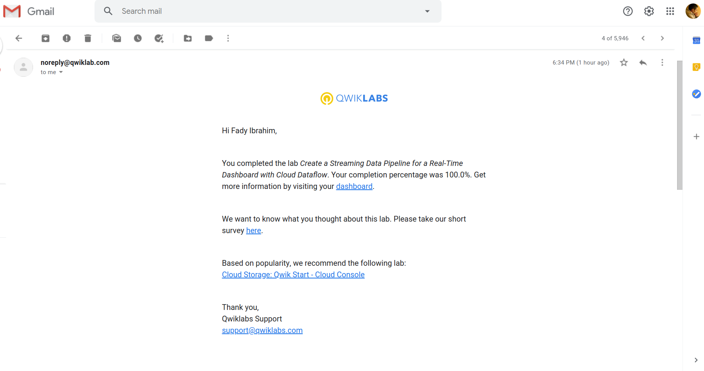
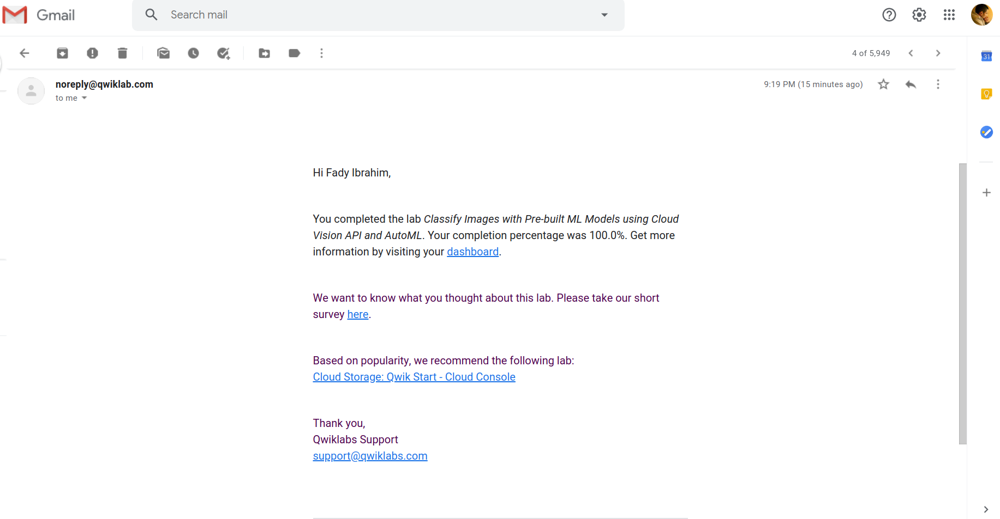
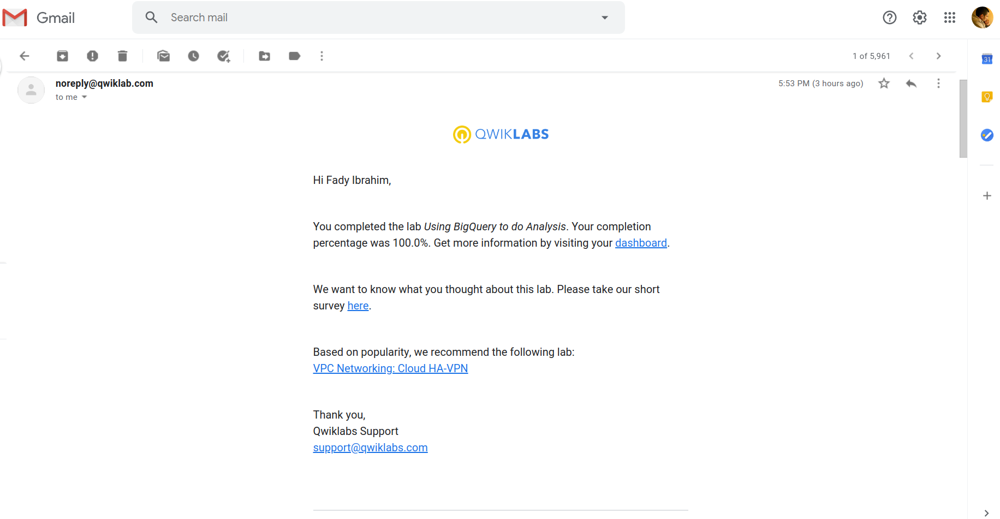
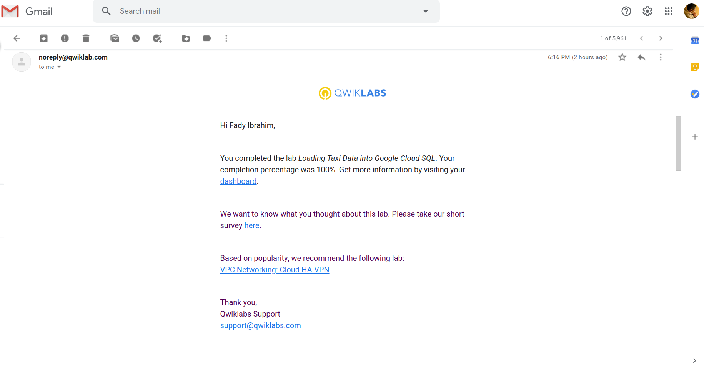
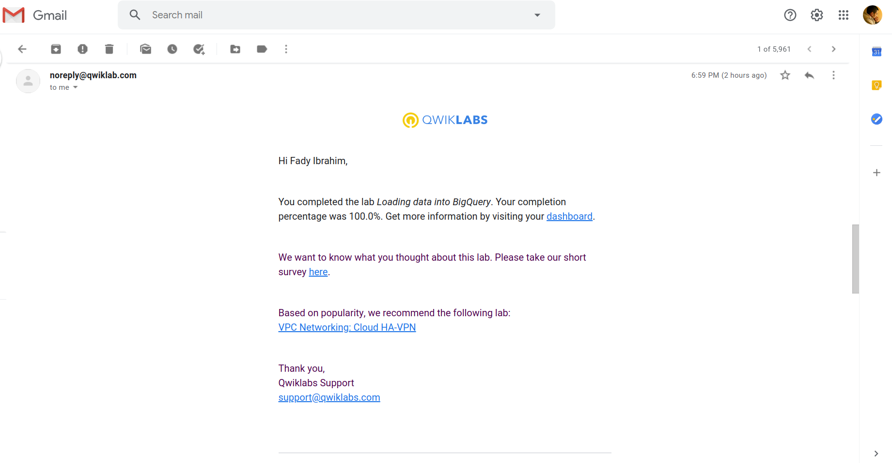
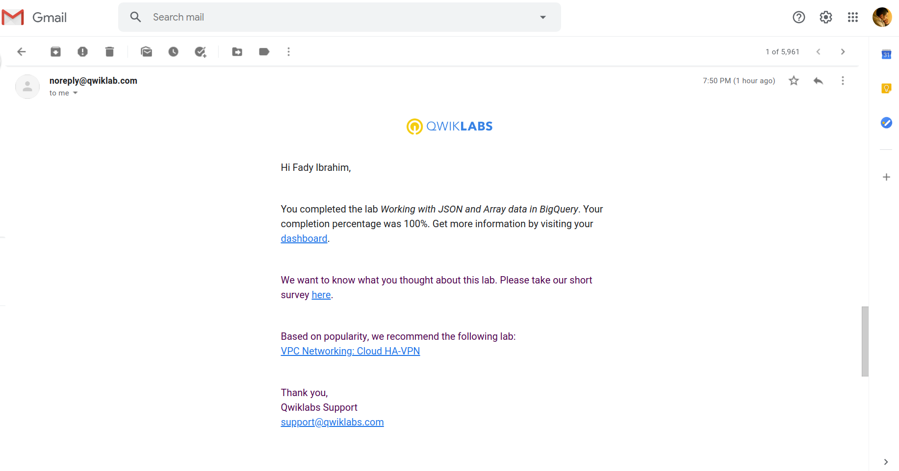
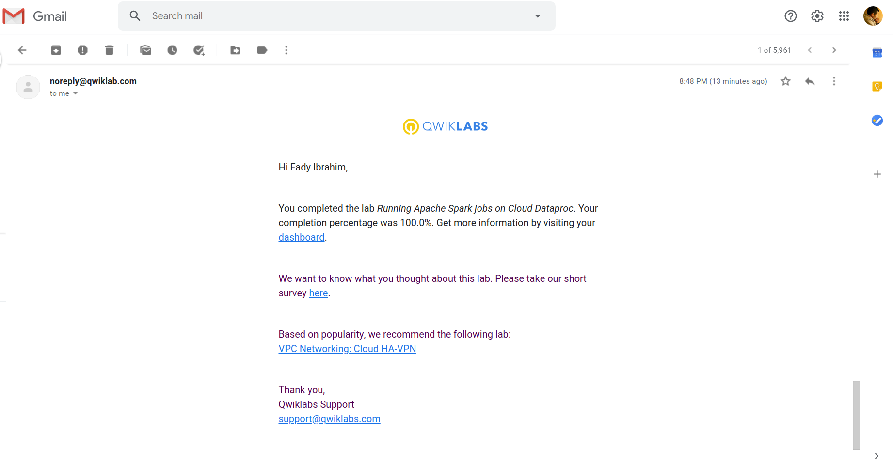

# GADS 2020 Project 1

  
  
Google Cloud Platform Big Data and Machine Learning Fundamentals Course: Lab 1

  
  

  
  
Google Cloud Platform Big Data and Machine Learning Fundamentals Course: Lab 2

  
  

  
  
Google Cloud Platform Big Data and Machine Learning Fundamentals Course: Lab 3

  
  

  
  
Google Cloud Platform Big Data and Machine Learning Fundamentals Course: Lab 4

  
  

  
  
Google Cloud Platform Big Data and Machine Learning Fundamentals Course: Lab 5

  
  

------

  
  
Modernizing Data Lakes and Data Warehouses with GCP: Lab 1

  
  

  
  
Modernizing Data Lakes and Data Warehouses with GCP: Lab 2

  
  

  
  
Modernizing Data Lakes and Data Warehouses with GCP: Lab 3

  
  

  
  
Modernizing Data Lakes and Data Warehouses with GCP: Lab 4

  
  

------

  
  
Building Batch Data Pipelines on GCP: Lab 1

  
  

