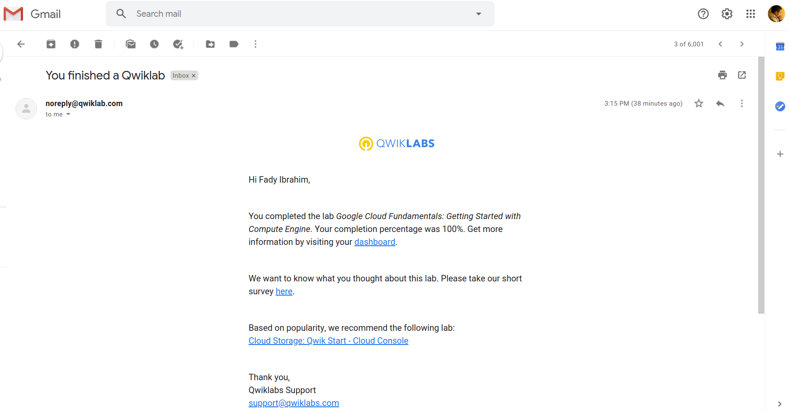

# GADS 2020 Project 1


<details>
  
  <summary>Google Cloud Platform Big Data and Machine Learning Fundamentals Course: Lab 1</summary>
  
  

</details>


<details>
  
  <summary>Google Cloud Platform Big Data and Machine Learning Fundamentals Course: Lab 2</summary>
  
  

</details>


<details>
  
  <summary>Google Cloud Platform Big Data and Machine Learning Fundamentals Course: Lab 3</summary>
  
  

</details>


<details>
  
  <summary>Google Cloud Platform Big Data and Machine Learning Fundamentals Course: Lab 4</summary>
  
  

</details>


<details>
  
  <summary>Google Cloud Platform Big Data and Machine Learning Fundamentals Course: Lab 5</summary>
  
  

</details>


------


<details>
  
  <summary>Modernizing Data Lakes and Data Warehouses with GCP: Lab 1</summary>
  
  

</details>


<details>
  
  <summary>Modernizing Data Lakes and Data Warehouses with GCP: Lab 2</summary>
  
  

</details>


<details>
  
  <summary>Modernizing Data Lakes and Data Warehouses with GCP: Lab 3</summary>
  
  

</details>


<details>
  
  <summary>Modernizing Data Lakes and Data Warehouses with GCP: Lab 4</summary>
  
  

</details>


------


<details>
  
  <summary>Building Batch Data Pipelines on GCP: Lab 1</summary>
  
  

</details>


------


<details>
  
  <summary>Google Cloud Platform Fundamentals - Core Infrastructure: Lab 1</summary>
  
  

</details>


------
  
  
## Translation labs

<details>
  
  <summary>Translation labs Google Cloud Platform Fundamentals - Core Infrastructure: Lab 1</summary>
  
  ```
gcloud config set project <WRITE_HERE_YOUR_PROJECT_ID>

gcloud compute instances create my-vm-1 \
	--zone=us-central1-a \
	--image-project=debian-cloud \
	--image=debian-9-stretch-v20200902 \
	--tags=http-server 

gcloud compute firewall-rules create default-allow-http \
	--allow tcp:80 \
	--target-tags http-server

gcloud compute instances create my-vm-2 \
	--zone=us-central1-b \
	--image-project=debian-cloud \
	--image=debian-9-stretch-v20200902 \

gcloud compute ssh --zone us-central1-b my-vm-2
	
	ping -c 2 my-vm-1
	sudo su -
	ssh my-vm-1
		sudo su -
		apt -y install nginx-light 
		curl http://localhost/
		sed -i '/^<h1>.*/a Hello from Fady!' /var/www/html/index.nginx-debian.html
		curl http://localhost/
		exit
		exit
	curl http://my-vm-1/
	exit
	exit
VM_IP=`gcloud compute instances describe my-vm-1 --zone us-central1-a --format 'get(networkInterfaces[0].accessConfigs[0].natIP)'`
curl http://$VM_IP
  ```

</details>
